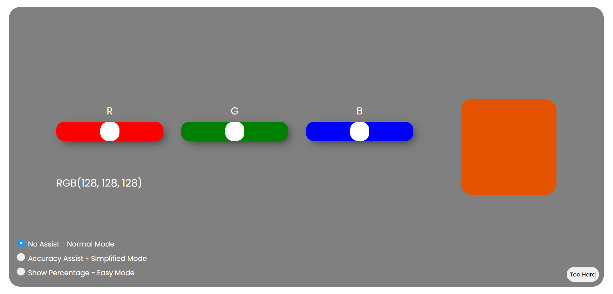
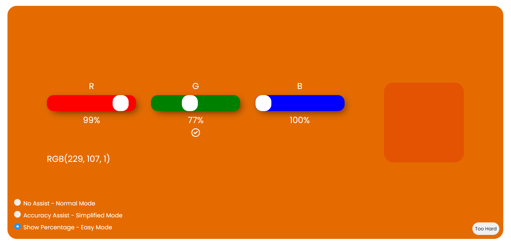

 

  <h3 align="center">Color Match</h3>

  

    Try to match colors using RGB colors. Have fun with different modes and improve your color knowledge.
     
     
  

   

## About The Project

Try to match colors using RGB colors. Have fun with different modes and improve your color knowledge.

- Development Stopped
- Feel free to use or contribute to the project. I'd appreciate it if you could provide references.

## Known Bugs

* When assists are changed, they don't close if there is an open icon.
* Percentage system doesn't work very well.

